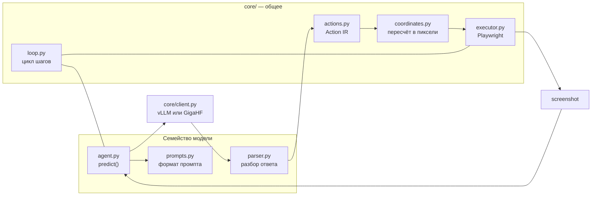

# GUI-агенты (скриншот → координаты)

Семейства моделей, которые работают **по пикселям**, а не по DOM: `qwen3_vl`, `uitars`, `jedi`, `opencua`, `evocua`. Модель видит скриншот вьюпорта и отвечает координатами клика; общий исполнитель воспроизводит действие в браузере.

Отличие от `bench_eval/harnesses/` — там LLM управляет браузером через DOM-инструменты browser-use; здесь модель не получает DOM вообще.

---

## Архитектура



| Файл | Роль |
|------|------|
| `core/actions.py` | Канонический `Action` IR + `ActionSpace` каждого семейства |
| `core/coordinates.py` | `CoordinateSpace` и пересчёт координат модели в пиксели вьюпорта |
| `core/executor.py` | `BrowserComputer` — Playwright-«экран»: скриншот, мышь, клавиатура, скролл, загрузки |
| `core/loop.py` | Цикл «наблюдение → предсказание → действие», сбор траектории |
| `core/registry.py` | Реестр моделей: `ModelSpec` + `VLLMSpec` (флаги запуска) |
| `core/settings.py` | Реестр ← env ← явные overrides |
| `core/client.py` | OpenAI-совместимый клиент + учёт токенов; `create_client()` выбирает транспорт по `GUI_AGENT_PLATFORM` |
| `core/gigahf.py` | Транспорт платформы GigaHF: async submit/poll вместо лимитированного sync, `extra_params`, TLS без проверки (внутренний CA) |
| `core/parsers.py` | Разбор pyautogui-кода (AST) и боксов — общий для opencua/evocua-S1/jedi |
| `harness.py` | Адаптер под `AGENT_HARNESS` — включает модель в штатный пайплайн бенча |

Ключевая идея: **у каждого семейства свой action space, но один исполнитель.** Парсер семейства опускает ответ модели в общий IR, а `ActionSpace.coerce()` деградирует действия, которых у семейства нет (например `triple_click` у UI-TARS → `double_click`), вместо падения.

---

## Action space по семействам

| Семейство | Формат ответа | Действия | Координаты |
|-----------|---------------|----------|------------|
| **qwen3_vl** | `Action: ...` + `<tool_call>{"name":"computer_use",...}</tool_call>` | key, type, mouse_move, left_click, left_click_drag, right_click, middle_click, double_click, scroll, wait, terminate | абсолютные пиксели resized-изображения (`resized`), либо сетка 0..999 (`relative999`) |
| **uitars** | `Thought: ...` + `Action: click(start_box='(x,y)')` | click, left_double, right_single, drag, hotkey, type, scroll, wait, finished, call_user | UI-TARS-1.5 — `resized`; 1.0/DPO — сетка 0..1000 (`relative1000`) |
| **jedi** | планировщик: одна строка pyautogui + `# описание цели`; grounder: `computer_use` tool call | pyautogui + DONE/FAIL/WAIT | grounder возвращает `resized` |
| **opencua** | `## Observation / ## Thought / ## Action / ## Code` + ```` ```python ```` | pyautogui + `computer.wait` / `computer.triple_click` / `computer.terminate` | нормированные 0..1 (`relative`), у 72B — сетка qwen2.5-VL (`qwen25`) |
| **evocua** | S2: как qwen3_vl (+ `triple_click`, `key_down`, `key_up`); S1: как opencua | см. выше | S2 — `resized`, S1 — `relative` |

Проверить фактический список: `python -m bench_eval.agents.cli.models`.

---

## Запуск модели через vLLM

Флаги запуска лежат в реестре (`VLLMSpec`), поэтому скрипты тонкие:

```bash
# 1. Посмотреть команду, ничего не запуская
python -m bench_eval.agents.cli.serve qwen3-vl-8b --print

# 2. Поднять сервер
python -m bench_eval.agents.cli.serve qwen3-vl-8b --port 8000
./bench_eval/agents/serve/serve_qwen3_vl.sh            # то же самое
MODEL=uitars-72b-dpo TP=4 ./bench_eval/agents/serve/serve_uitars.sh

# 3. Локальный чекпоинт вместо HF-репозитория
python -m bench_eval.agents.cli.serve opencua-7b --model-path /data/OpenCUA-7B

# 4. Любой неизвестный флаг уходит в vllm serve как есть
python -m bench_eval.agents.cli.serve jedi-7b --enable-prefix-caching

# 5. Проверить, что сервер поднялся
python -m bench_eval.agents.cli.serve --health http://127.0.0.1:8000/v1
```

Скрипты по семействам: `serve/serve_qwen3_vl.sh`, `serve_uitars.sh`, `serve_jedi.sh`, `serve_opencua.sh`, `serve_evocua.sh`. Переменные: `MODEL`, `HOST`, `PORT`, `TP`, `MAX_MODEL_LEN`, `GPU_MEMORY_UTILIZATION`, `MODEL_PATH`.

> `hf_repo` в реестре — ориентир. Перед первым запуском сверьте id чекпоинта (особенно для `evocua-*`) и при необходимости передайте `--model-path`.

---

## Инференс и бенчмарк

```bash
# Одно предсказание по сохранённому скриншоту — без браузера
python -m bench_eval.agents.cli.infer uitars-1.5-7b \
  --screenshot shot.png --task "Открой раздел Книги" --dry-run

# Одна задача в реальном браузере
python -m bench_eval.agents.cli.infer qwen3-vl-8b \
  --url http://127.0.0.1:5173/<track_id>/state_hub/bench_hub \
  --task "Найди чайник и добавь в корзину" --max-steps 10 --save-screenshots ./shots

# Пакетный прогон по tests/bench (нужен запущенный стенд)
python -m bench_eval.agents.cli.benchmark opencua-7b --max-tasks 5 --output runs/opencua.json

# Канонический прогон через DeepEval (отчёты, лидерборд)
./scripts/run_eval.sh opencua/opencua-7b
```

`cli/benchmark.py` — быстрый sweep со своим JSON-отчётом; `scripts/run_eval.sh` — штатный путь со всей отчётностью бенча.

Внешний запуск той же оценки — `python -m bench_eval.eval_api` (порт `9100`,
`EVAL_SERVICE_PORT`). Сервис не поднимает фронт и бэк: они уже должны слушать
`127.0.0.1:5173` и `localhost:9000`. На задачу он вызывает тот же
`deepeval test run tests/evals/test_agent_bench.py`, что и `./scripts/run_eval.sh`,
и отдаёт два скора (`agent_completion`, `conditions`) плюс путь к `results.json`.
Ключ модели попадает только в окружение дочернего процесса DeepEval.

---

## Переменные окружения

| Переменная | Смысл |
|------------|-------|
| `AGENT_HARNESS` | `qwen3-vl` \| `uitars` \| `jedi` \| `opencua` \| `evocua` \| `gui-agent` |
| `GUI_AGENT_MODEL` | Имя модели в реестре (`opencua-32b`). Для `gui-agent` — обязательно |
| `GUI_AGENT_BASE_URL` | URL vLLM (`http://127.0.0.1:8000/v1`) или платформы |
| `GUI_AGENT_API_KEY` | Ключ; для локального vLLM — `EMPTY`, для GigaHF — Bearer-токен |
| `GUI_AGENT_PLATFORM` | `vllm` (по умолчанию) \| `gigahf`. Без явного значения определяется по хосту |
| `GUI_AGENT_SERVED_MODEL` | `--served-model-name`, если он отличается от имени в реестре |
| `GUI_AGENT_COORDINATE_SPACE` | Переопределить систему координат (`resized`, `relative`, `relative1000`, `qwen25`, …) |
| `GUI_AGENT_HISTORY_N` | Сколько прошлых скриншотов слать модели |
| `GUI_AGENT_TEMPERATURE`, `GUI_AGENT_TOP_P`, `GUI_AGENT_MAX_TOKENS` | Сэмплирование |
| `GUI_AGENT_SCREEN_WIDTH` / `_HEIGHT` | Размер вьюпорта (по умолчанию 1280×720) |
| `GUI_AGENT_SAVE_SCREENSHOTS`, `GUI_AGENT_SCREENSHOT_DIR` | Сохранять PNG каждого шага |
| `AGENT_MAX_STEPS`, `AGENT_HEADLESS` | Общие настройки бенча — используются как есть |
| `OPENCUA_COT_LEVEL` | `l1` \| `l2` \| `l3` |
| `EVOCUA_PROMPT_STYLE` | `S1` \| `S2` |
| `JEDI_PLANNER_MODEL`, `JEDI_PLANNER_BASE_URL`, `JEDI_PLANNER_API_KEY` | Внешний планировщик для Jedi |
| `GIGAHF_MODE` | `async` (submit/poll, ~150 RPS) \| `sync` (10 запросов в минуту на IP) |
| `GIGAHF_POLL_INTERVAL`, `GIGAHF_POLL_TIMEOUT`, `GIGAHF_SYNC_RPM` | Поллинг и клиентский лимитер |
| `GIGAHF_EXTRA_PARAMS` | JSON, уезжает в `extra_params` запроса (например `model_path`) |

Опции семейства переопределяются по правилу `<FAMILY>_<OPTION>` (заглавными) — оно работает для любой новой опции автоматически.

---

## Как добавить новую модель

**Другой чекпоинт существующего семейства** — одна запись в `<family>/__init__.py`:

```python
QWEN3_VL_2B = register(
    _spec("qwen3-vl-2b", "Qwen/Qwen3-VL-2B-Instruct", aliases=("qwen3vl-2b",))
)
```

Больше ничего: CLI, vLLM-скрипты, harness и отчёты подхватят её сами.

**Новое семейство** — каталог `bench_eval/agents/<family>/`:

1. `prompts.py` — формат промпта ровно такой, на котором модель обучалась.
2. `parser.py` — разбор ответа в `list[Action]`; координаты пересчитывает `CoordinateScaler`, а не парсер вручную.
3. `agent.py` — подкласс `GUIAgent` с одним методом `predict()`.
4. `__init__.py` — `ActionSpace` семейства и `register(ModelSpec(...))`.
5. Добавьте `"<family>": "bench_eval.agents.<family>"` в `_FAMILY_MODULES` (`core/registry.py`).
6. Для запуска через `AGENT_HARNESS=<family>`: имя в `_GUI_HARNESSES` (`bench_eval/harness_compat.py`) и алиас в `bench_eval/harness_names.py`.
7. Тесты: добавьте кейсы в `tests/agents/test_gui_agents.py` — реальный ответ модели → ожидаемый `Action`.

Если модель уже отвечает pyautogui-кодом, шаг 2 сводится к `parse_pyautogui_code(code, scaler)`.

---

## Тесты

```bash
pytest tests/agents/            # парсеры, реестр, координаты, цикл шагов
```

Всё гоняется без GPU, без поднятого vLLM и без браузера: модель заменена стабом, браузер — стабом.
