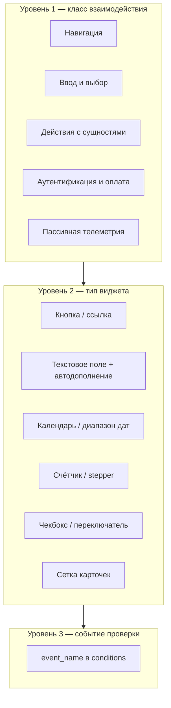

# Таксономия типов UI-взаимодействий (WebPageBench)

Классификация **элементов интерфейса и действий агента** на моках WebPageBench: что пользователь (или агент) может сделать на странице и какие типизированные события фиксируются для Event-Match Score.

Документ дополняет [TAXONOMY.md](./TAXONOMY.md) (таксономия **задач** и доменов), а не заменяет его.

**Источники анализа:**

| Источник | Что извлечено |
|----------|----------------|
| `site/frontend/src/views/bench/*`, `site/frontend/src/hotels/*` | Реализация виджетов, `_logActivity` / `useHotelTrackEvent` |
| `site/frontend/src/common/tracker.js` | Пассивная телеметрия (клик, скролл, …) |
| `tests/bench/tasks/*.json` | **152** задачи (65 канонических + 87 вариантов контролов; 6 вкладок хаба) |
| `tests/bench/config.json` → `domain_configs.*.common_elements` | Конфигурация хедера, поиска, форм |

---

## 1. Уровни классификации



| Уровень | Пример | Назначение |
|---------|--------|------------|
| **Класс** | `Ввод и выбор` → `Выбор даты` | Обучение/оценка агентов по навыкам |
| **Виджет** | `DateRangeField`, `RailDatePicker` | Привязка к компонентам фронтенда |
| **Событие** | `select_date`, `bench_hotel_select_start_date` | Автоматическая верификация в `conditions` |

---

## 2. Сводная таблица классов UI-взаимодействий

| ID | Класс | Типичные виджеты | События проверки (основные) | Моки |
|----|-------|------------------|----------------------------|------|
| **NAV** | Навигация по сайту | Вкладки хаба, логотип, меню, `router-link` | `state_changed` | все |
| **BTN** | Нажатие кнопки / ссылки | CTA, «В корзину», «Найти», табы | `button_clicked`, `state_changed` | books, hub |
| **TXT** | Ввод текста | `<input>`, поисковая строка | *(часто без отдельного event; см. SEARCH)* | shop |
| **SEARCH** | Поиск с подсказками | Autocomplete, теги подсказок, Enter | `submit_search` | shop, books, rail |
| **SELECT_AC** | Выбор из списка (autocomplete) | Станции ЖД, город отеля, подсказки книг | `select_city`, `bench_hotel_select_city` | rail, hotels |
| **SELECT_LIST** | Выбор из списка (клик по опции) | Dropdown станций, список годов | `select_city`, `bench_files_select_year` | rail, hotels, files |
| **DATE** | Выбор даты / периода | Календарь, date picker | `select_date`, `bench_hotel_select_start_date`, `bench_hotel_select_end_date` | rail, hotels |
| **COUNTER** | Счётчик (+/−) | Пассажиры, количество в корзине | `select_passenger` *(косвенно)*, `basket_add`/`amount` | rail, shop, grocery |
| **CHECK** | Чекбокс / toggle | Фильтры, «место у окна», тарифы | `apply_filter`, `select_seat` *(атрибуты)* | rail, books |
| **RADIO** | Радиокнопки / табы | Тариф, тип поездки, способ оплаты | `select_tariff`, `select_pay_method` | rail, books |
| **CARD** | Карточка в сетке / карусели | Товар, книга, поезд, отель | `select_train`, `bench_hotel_select_hotel`, переход `state_changed` | все каталоги |
| **SEAT** | Выбор места (схема) | SVG/сетка мест в вагоне | `select_seat` | rail |
| **BASKET** | Корзина | Добавить / убрать / изменить кол-во | `basket_add`, `basket_remove` | shop, grocery, books, rail |
| **FAV** | Избранное | Иконка «сердце» | `add_favorites`, `remove_favorites` | shop, books |
| **FILTER** | Фильтрация / сортировка | Боковая панель, чипы | `apply_filter`, `apply_sort` | rail, books |
| **AUTH** | Авторизация | Модалка логина, телефон, код | `submit_login`, `submit_pass`, `submit_phone`, … | shop, books, grocery |
| **PAY** | Оплата | Кнопка «Оплатить», карта | `submit_payment`, `select_pay_method` | rail, shop, books, grocery |
| **FILES** | Кабинет файлов | Коллекции, год, скачивание PDF/CSV | `bench_files_*` | bench files |
| **PASSIVE** | Низкоуровневая активность | Любой DOM | `click`, `keypress`, `scroll` *(не в conditions)* | tracker |

---

## 3. Детализация по классам

### 3.1. NAV — Навигация

| Подтип | Описание | UI-элемент | Событие | Где |
|--------|----------|------------|---------|-----|
| `nav_hub_tab` | Переход между разделами единого бенчмарка | Карточки на `bench_hub` | `state_changed` (`new_state`: `bench_catalog_main`, …) | `tests/bench` |
| `nav_logo` | Клик по логотипу → главная раздела | `header.logo` в config | `state_changed` | shop, grocery, rail, books |
| `nav_menu_item` | Пункт горизонтального/бокового меню | `menu.items`, `leftMenu` | `state_changed` | shop, grocery, books |
| `nav_header_control` | Иконки «Корзина», «Избранное», «Войти» | `search_bar.panelButtons[]` (shop/grocery/books); legacy `header.controls[]` | `state_changed` + иногда `dialog_opened` | shop (`bench_catalog_*`), grocery, books |
| `nav_product_card` | Переход на карточку товара/книги | Плитка в `grid` / carousel | `state_changed` | все ecommerce / books |
| `nav_route` | SPA-переход по маршруту Vue | `router.push` | `state_changed` | отели → `bench_hotel_search` |

**Проверка в задачах:** 30 вхождений `state_changed` в `tests/bench`; параметр `new_state` / `state_id`.

---

### 3.2. SEARCH — Поиск

| Подтип | Поведение агента | Реализация | Событие |
|--------|------------------|------------|---------|
| `search_catalog` | Ввести запрос → Enter или клик «Найти» | `SearchBar.vue` (Маркет), подсказки `search_bar.suggestionsList` / `suggestions_list` | переход на `bench_catalog_search?q=` + `submit_search`; `state_changed` |
| `search_books` | Строка «Искать книги» + подсказки авторов | `SearchBar.vue` | `submit_search` (`value`: строка запроса) |
| `search_trains` | Отправление формы маршрута | `RailSearchWidget.search()` | `submit_search` (`city_from`, `city_to`, `date_*`, `passengers_amount`) |
| `search_grocery` | Строка в шапке Продуктов | `SearchBar.vue` → `bench_grocery_main?q=` (`Category.vue` фильтр с 3 символов) | отдельного event нет; задачи named grocery завязаны на витрину и меню |
| `search_hotels` | Кнопка «Найти» с заполненными полями | `SearchForm.vue` | Навигация на `bench_hotel_search` (часто + цепочка `bench_hotel_select_*`) |

**Связанные элементы config:** `header.search` (placeholder, scopes), `search_bar.suggestionsList`, `suggestions_list` по ключам запроса (shop).

---

### 3.3. SELECT_AC / SELECT_LIST — Выбор из списка

| Подтип | Ввод | Подтверждение | Событие | Параметры conditions |
|--------|------|---------------|---------|----------------------|
| `station_from_to` | Текст станции + dropdown | Клик по станции в списке | `select_city` | `field`: `from` \| `to`, `name` |
| `destination_city` | «Город, отель…» + фильтрация | Клик по опции | `bench_hotel_select_city` | `cityId`, `label`, `cityName`, `countryName` |
| `suggestion_pick` | Подсказка в поиске книг/товаров | Enter / клик | `submit_search` или навигация | `value` / `q` в query |

События отелей в задачах: `bench_hotel_select_*`.

---

### 3.4. DATE — Выбор даты

| Подтип | UI | Событие | Параметры |
|--------|-----|---------|-----------|
| `date_departure` | Календарь ЖД, режим «туда» | `select_date` | `direction`: `departure`, `date` (**ISO** `YYYY-MM-DD`, как `formatDateISO`) |
| `date_return` | Календарь ЖД, «обратно» | `select_date` | `direction`: `return`, `date` |
| `date_checkin` | `DateRangeField` (отели) | `bench_hotel_select_start_date` | `date` (ISO) |
| `date_checkout` | То же, второй клик | `bench_hotel_select_end_date` | `date` (ISO) |

Календарь отелей ставит `minDate` на «сегодня»: даты в conditions `tests/bench/tasks/hotel_*.json` должны быть не раньше текущей даты стенда (срез 2026-08-15 → заезды с сентября 2026). Заголовок месяца в сетке — `«Сентябрь 2026»` (`titleFull`).

**Атомарные задачи отелей** (`hotel_atomic_select_*`) проверяют ровно один шаг DATE или SELECT.

---

### 3.5. COUNTER — Счётчики и количество

| Подтип | UI | Влияние на проверку |
|--------|-----|---------------------|
| `passengers_rail` | `RailPassengersDropdown` (+/− взрослые/дети) | Учитывается в `submit_search.passengers_amount`; отдельного event при каждом +/− нет |
| `guests_hotel` | `GuestPicker` (комнаты, взрослые, дети) | `bench_hotel_select_guests` при «Готово»; проверяется **последнее** число гостей/комнат |
| `basket_quantity` | +/- на карточке или в корзине | `basket_add` / `basket_remove` с `amount` — **точное итоговое** число в корзине, не промежуточный клик |

---

### 3.6. CARD + доменные выборы (поезд, тариф, отель, комната)

| Подтип | Действие | Событие | Ключевые параметры |
|--------|----------|---------|-------------------|
| `train_pick` | Выбор строки рейса | `select_train` | `train_name`, `from_station`, `to_station` |
| `tariff_pick` | Класс обслуживания | `select_tariff` | `tarif_name`, `direction` |
| `seat_map` | Клик по месту в вагоне | `select_seat` | `seats_amount` (итоговое число мест), `near_window`, `lower_berth` |
| `passenger_pick` | Выбор пассажира из списка | `select_passenger` | `passenger_index`, `passenger_config_index` |
| `hotel_pick` | Карточка отеля в выдаче | `bench_hotel_select_hotel` | id/название отеля |
| `room_pick` | Вариант номера | `bench_hotel_select_room` | тип номера, цена |

---

### 3.7. BASKET / FAV — Каталог e-commerce и книги

| Подтип | UI | Событие |
|--------|-----|---------|
| `add_to_cart` | «В корзину», быстрая покупка | `basket_add` (`item_id`, `amount` — точное итоговое число, если задано; иногда `title`, `author`) |
| `remove_from_cart` | Удаление, уменьшение qty | `basket_remove` |
| `add_to_favorites` | Сердечко на карточке | `add_favorites` |
| `remove_from_favorites` | Повторный клик | `remove_favorites` |

**Покрытие задачами (conditions в `tests/bench`):** `basket_add` — 73; `add_favorites` — 16.

**Домены:** shop, grocery, books (корзина); shop, books (избранное); rail (`basket_add` = билет в корзине).

---

### 3.8. FILTER / SORT — Уточнение выдачи

| Подтип | UI (ЖД) | `filter_type` в event |
|--------|----------|------------------------|
| `filter_price` | Слайдер/чипы цены | `price` |
| `filter_duration` | Длительность | `duration` |
| `filter_time` | Время отправления/прибытия | `departure_time`, `arrival_time` |
| `filter_train` | Тип/название поезда | `train_type`, `train_name` |
| `filter_car` | Класс вагона | `car_class` |
| `filter_services` | Услуги в поезде | `services` |
| `sort` | Сортировка списка | `apply_sort` |
| `filter_reset` | Сброс | `reset` |

**Книги:** `apply_filter` — subscription, abonement, format, language, authors, …

В **conditions** задач ЖД фильтры встречаются реже, чем `select_train`; в `target_events` часто перечислены для полноты сценария.

---

### 3.9. AUTH / PAY

| Подтип | Шаги UI | События |
|--------|---------|---------|
| `login_email_password` | Логин + пароль → «Войти» | `submit_login`, `submit_pass` |
| `login_phone_code` | Телефон → SMS-код | `submit_phone`, `submit_code`, `login_success` / `login_failed` |
| `login_oauth_hint` | СберID и т.п. | `authorize_sber_id` (grocery) |
| `dialog_login_open` | Открытие модалки | `dialog_opened` (`name`: `login`) |
| `pay_checkout` | Подтверждение оплаты | `submit_payment` (`result`, `amount`, …) |
| `pay_method_select` | Выбор СБП / карты | `select_pay_method` |

**Задачи с оплатой:** 3 сценария ЖД (`rail_book_and_pay*`).

---

### 3.10. FILES — Кабинет документов

| Подтип | Действие пользователя | Событие |
|--------|----------------------|---------|
| `files_select_collection` | Выбрать коллекцию на кабинете | `bench_files_select_collection` |
| `files_select_year` | Выбрать год в коллекции | `bench_files_select_year` |
| `files_download` | Скачать локальный PDF или CSV | `bench_files_download` |

Пустое состояние, пока год не выбран: «Выберите год, чтобы увидеть доступные файлы.» Авторизации нет. Файлы отдаются с `/mocks/files/`. Число карточек зависит от года (2–18); в архиве — помесячные имена `YYYY-MM`.

---

### 3.11. PASSIVE — Пассивная телеметрия

`ActivityTracker` (`tracker.js`) пишет события **без** использования в `conditions`:

| type | Когда |
|------|-------|
| `click` | Любой клик (tag, class, координаты) |
| `keypress` | Клавиши |
| `scroll` | Прокрутка (throttle 500 ms) |
| `input` | Ввод (закомментирован в listener) |
| `visibility` | Смена вкладки браузера |
| `mousemove` | Движение мыши (throttle 1 s) |

Используются для отладки и анализа траекторий, не для автоматического pass/fail.

---

## 4. Словарь событий проверки (агрегат по задачам)

Уникальные `event_name` из **152** JSON-файлов `tests/bench/tasks/` (варианты повторяют `conditions` доноров, частоты событий растут пропорционально):

| Событие | Вхождений в conditions | Класс UI | Примечание |
|---------|------------------------|----------|------------|
| `basket_add` | 39 | BASKET / CARD | Самое частое |
| `select_city` | 15 | SELECT_LIST | ЖД (from/to) |
| `state_changed` | 14 | NAV | |
| `add_favorites` | 10 | FAV | |
| `select_date` | 8 | DATE | ЖД |
| `select_tariff` | 6 | RADIO/CARD | |
| `select_train` | 4 | CARD | |
| `select_passenger` | 3 | CARD | ЖД |
| `submit_search` | 3 | SEARCH | |
| `submit_payment` | 3 | PAY | `rail_book_and_pay*` |
| `select_seat` | 2 | SEAT | |
| `bench_hotel_select_*` | 24 суммарно | SELECT/DATE/COUNTER | отели |
| `bench_files_*` | 29 суммарно | FILES | кабинет файлов |

---

## 5. Моки → доминирующие типы UI

| Мок / раздел bench | Ключевые UI-паттерны | Типичная цепочка событий |
|--------------------|----------------------|---------------------------|
| **shop** / Маркет | SEARCH, CARD, BASKET, FAV, FILTER, AUTH | поиск/каталог → карточка → `basket_add` |
| **grocery** / Продукты | NAV (меню), BASKET, AUTH | категория → `basket_add` |
| **books** / Книги | SEARCH, CARD, BASKET, FAV, FILTER, AUTH, PAY | `submit_search` → `basket_add` / `add_favorites` |
| **rail** / Поезда | SELECT_AC×2, DATE, SEARCH, FILTER, CARD, SEAT, AUTH, PAY | `select_city` → `select_date` → `submit_search` → … → `basket_add` |
| **hotels** / Отели | SELECT_AC, DATE×2, COUNTER, SEARCH, CARD (отель/номер) | `bench_hotel_select_*` → `state_changed` (search) |
| **bench files** / Файлы | CARD, SELECT_LIST, FILES | `bench_files_select_collection` → `bench_files_select_year` → `bench_files_download` |
| **bench hub** | NAV (`nav_hub_tab`) | один `state_changed` |

---

## 6. Элементы из `common_elements` (единый config)

Секции `domain_configs` в `tests/bench/config.json` описывают **статические** UI-блоки (не все порождают отдельные events):

| Секция | Тип взаимодействия | Примеры полей |
|--------|-------------------|---------------|
| `header` | NAV, SEARCH, BTN | `logo`, `catalogButton`, `search`, `controls[]` (`button_type`: login, basket) — legacy shop header |
| `suggestions_list` | SEARCH / SELECT_AC | Теги и подсказки по ключу запроса |
| `search_bar` | SEARCH + NAV | `searchPlaceholder`, `searchButtonCaption`, `additionalButton` (Каталог — books/grocery), `suggestionsList`, `panelButtons` (избранное/корзина/профиль **своего** домена) |
| `menu` / `leftMenu` | NAV | `items[]`, `categories[]` |
| `loginForm` | AUTH | placeholders, `buttonLabel` |
| `grid` / `item_carousel` | CARD | `kv_id` товаров/книг |
| `searchWidget` (rail) | SEARCH + DATE + COUNTER | `tabs`, `defaultPassengers` |

---

## 7. Матрица: класс UI → моки

|  | shop | books | grocery | rail | hotels | files | hub |
|--|:---:|:---:|:---:|:---:|:---:|:---:|:---:|
| NAV | ✓ | ✓ | ✓ | ✓ | ✓ | ✓ | ✓ |
| SEARCH | ✓ | ✓ | ○ | ✓ | ✓ | — | — |
| SELECT_AC | ○ | ✓ | — | ✓ | ✓ | — | — |
| DATE | — | — | — | ✓ | ✓ | — | — |
| COUNTER | ✓ | — | ✓ | ✓ | ✓ | — | — |
| BASKET | ✓ | ✓ | ✓ | ✓ | — | — | — |
| FAV | ✓ | ✓ | — | — | — | — | — |
| FILTER | ✓ | ✓ | ○ | ✓ | ○ | — | — |
| SEAT | — | — | — | ✓ | — | — | — |
| AUTH | ✓ | ✓ | ✓ | ✓ | ○ | — | — |
| PAY | ✓ | ✓ | ✓ | ✓ | — | — | — |
| FILES | — | — | — | — | — | ✓ | — |

✓ — явно в сценариях задач; ○ — UI есть, в conditions редко; — — не применимо.

---

## 11. Варианты UI (config-driven)

Единый бенчмарк поддерживает **несколько визуальных/UX-паттернов** для одних и тех же классов таксономии. Вариант задаётся в `domain_configs.<domain>.ui_variants` (или глобально в `ui_variants` / `test_data.ui_variants`). Глобальная тема — ключ `theme` (`light` по умолчанию, `dark` в 12 вариантах); страница открывается уже в теме (`data-bench-theme` на `<html>`).

Канонический eval — **152** JSON в `tests/bench/tasks/`: 65 канонических задач с контролами по умолчанию плюс **87 вариантов**, которые вписывают профиль в саму задачу (`scripts/ui_pattern_task_map.py`). Профили в `tests/bench/configs/` остаются для demo и schema-проверки (`pytest tests/bench/test_ui_variants.py`); смешанные hotel/rail-профили в eval не клонируются.

```json
{
  "domain_configs": {
    "hotels": {
      "ui_variants": {
        "date": "text_input",
        "select_city": "autocomplete",
        "counter_guests": "pill_buttons"
      }
    }
  }
}
```

Приоритет разрешения: `domain_configs[active_domain].ui_variants` → `test_data.ui_variants` → `ui_variants` → значение по умолчанию.

**События проверки не меняются** — меняется только способ взаимодействия агента с виджетом.

### 11.1. Справочник вариантов по виджетам

| Ключ виджета | Класс таксономии | Домены | Варианты | Описание |
|--------------|------------------|--------|----------|----------|
| `date` | **DATE** | hotels | `split_popup` | Два поля «Заезд/Выезд» + popup-календарь (по умолчанию) |
| | | hotels | `inline_calendar` | Календарь всегда виден под полем |
| | | hotels | `text_input` | Ввод дат строкой `ДД.ММ.ГГГГ` |
| | | hotels | `single_popup` | Одно поле «Даты поездки» + popup диапазона |
| | | rail | `popup_grid` | Поля «Туда/Обратно» + сетка-календарь ЖД (по умолчанию) |
| | | rail | `native_input` | `<input type="date">` |
| | | rail | `text_input` | Текстовые поля `ДД.ММ.ГГГГ` |
| `select_city` | **SELECT_AC** | hotels | `autocomplete` | Input + dropdown подсказок (по умолчанию) |
| | | hotels | `native_select` | HTML `<select>` |
| `select_station` | **SELECT_LIST** | rail | `typeahead` | Input + dropdown станций (по умолчанию) |
| | | rail | `native_select` | HTML `<select>` |
| `counter_guests` | **COUNTER** | hotels | `rooms_popup` | Popup с комнатами и stepper (по умолчанию) |
| | | hotels | `inline_stepper` | +/- взрослых в строке поля |
| | | hotels | `compact_select` | `<select>` с числом гостей |
| | | hotels | `pill_buttons` | Горизонтальные pill-кнопки 1–6 |
| `text_search` | **TXT** | shop, books | `standard` | Стандартный вид (по умолчанию) |
| | | | `outlined` | Vuetify outlined |
| | | | `filled` | Заливка фона поля |
| | | | `underlined` | Только нижняя граница |
| | | | `pill` | Скруглённая «капсула» |
| | | | `large` | Увеличенный шрифт и высота |
| `collections` | **CARD** | files | `cards` | Сетка коллекций (по умолчанию) |
| | | files | `list` | Список |
| | | files | `tree` | Дерево |
| | | files | `compact` | Компактный список |
| `years` | **SELECT_LIST** | files | `select` | Выпадающий список годов |
| | | files | `buttons` | Чипы годов |
| | | files | `radio` | Радиокнопки |
| `buttons` | **BTN** | files | `outline` | Контурная ссылка «Скачать» (по умолчанию) |
| | | files | `solid` | Залитая кнопка (demo-only) |
| | | files | `icon` | `↓` без подписи, `aria-label="Скачать локальный файл"` |
| | | files | `split` | Не реализован во фронте (fallback на `solid`; не клонируем) |
| `theme` | chrome | все разделы | `light` | Светлая палитра `.bench-anonymized` (дефолт, без вариантов) |
| | | все разделы | `dark` | Токены `#1a1f2e` / светлый текст; `data-bench-theme="dark"` |

### 11.2. Таблица тестовых конфигов (`tests/bench/configs/`)

Каждый JSON — overlay поверх `tests/bench/config.json`. Поле `profile_id` совпадает с именем файла (без `.json`).

| Конфиг | Домен | Классы UI | Виджеты / варианты |
|--------|-------|-----------|-------------------|
| `hotels_default` | hotels | DATE, SELECT_AC, COUNTER | date=`split_popup`, select_city=`autocomplete`, counter_guests=`rooms_popup` |
| `hotels_date_inline` | hotels | DATE, SELECT_AC, COUNTER | date=`inline_calendar` |
| `hotels_date_text` | hotels | DATE, SELECT_AC, COUNTER | date=`text_input` |
| `hotels_date_single` | hotels | DATE, SELECT_AC, COUNTER | date=`single_popup` |
| `hotels_city_native` | hotels | SELECT_AC | select_city=`native_select` |
| `hotels_city_modal` | hotels | SELECT_AC | select_city=`autocomplete` |
| `hotels_guests_inline` | hotels | COUNTER | counter_guests=`inline_stepper` |
| `hotels_guests_compact` | hotels | COUNTER | counter_guests=`compact_select` |
| `hotels_guests_pills` | hotels | COUNTER | counter_guests=`pill_buttons` |
| `hotels_mixed_v1` | hotels | DATE, SELECT_AC, COUNTER | date=`text_input`, select_city=`native_select`, counter_guests=`inline_stepper` |
| `hotels_date_text_city_modal` | hotels | DATE, SELECT_AC, COUNTER | date=`text_input`, select_city=`autocomplete`, counter_guests=`compact_select` |
| `hotels_inline_pills_native` | hotels | DATE, SELECT_AC, COUNTER | date=`inline_calendar`, select_city=`native_select`, counter_guests=`pill_buttons` |
| `hotels_single_modal_pills` | hotels | DATE, SELECT_AC, COUNTER | date=`single_popup`, select_city=`autocomplete`, counter_guests=`pill_buttons` |
| `rail_date_popup` | rail | DATE, SELECT_LIST | date=`popup_grid`, select_station=`typeahead` |
| `rail_date_native` | rail | DATE, SELECT_LIST | date=`native_input` |
| `rail_date_text` | rail | DATE, SELECT_LIST | date=`text_input` |
| `rail_station_native` | rail | SELECT_LIST | select_station=`native_select` |
| `rail_station_buttons` | rail | SELECT_LIST | select_station=`native_select` |
| `rail_mixed_v1` | rail | DATE, SELECT_LIST | date=`native_input`, select_station=`native_select` |
| `rail_date_native_buttons` | rail | DATE, SELECT_LIST | date=`native_input`, select_station=`native_select` |
| `rail_date_text_buttons` | rail | DATE, SELECT_LIST | date=`text_input`, select_station=`typeahead` |
| `files_layout_cards` | files | CARD, SELECT_LIST, FILES | collections=`cards` |
| `files_layout_list` | files | CARD, SELECT_LIST, FILES | collections=`list` |
| `files_layout_tree` | files | CARD, SELECT_LIST, FILES | collections=`tree` |
| `files_layout_compact` | files | CARD, SELECT_LIST, FILES | collections=`compact` |
| `shop_search_underlined` | shop | TXT | text_search=`underlined` |
| `shop_search_pill` | shop | TXT | text_search=`pill` |
| `books_search_underlined` | books | TXT | text_search=`underlined` |
| `books_search_pill` | books | TXT | text_search=`pill` |
| `books_search_filled` | books | TXT | text_search=`filled` |
| `bench_taxonomy_matrix` | hotels, rail, files | DATE, SELECT_AC, COUNTER, SELECT_LIST, CARD | hotels: text+native+compact; rail: native+native; files: list |
| `bench_taxonomy_all_domains` | hotels, rail, files, shop, books | DATE, SELECT_AC, COUNTER, SELECT_LIST, CARD, TXT | все домены с альтернативными паттернами |
| `theme_dark` | все | chrome | `theme=dark` (глобально, без смены виджетов) |

### 11.3. Клоны в каноническом eval

Имя: `{stem}__{widget}_{variant}.json`. Промпты не переписываем — тот же success criterion, другой DOM. Не генерируем варианты для `*_typo*`, grocery-контролов (кроме темы), mixed hotel/rail-профилей, `buttons:split`. Файлы — один mixed-оверлей на 5 задач (`collections:list` + `years:buttons` + `buttons:icon`). Тема не смешивается с заменой контрола.

| Паттерн | Клонов | Доноры |
|---------|-------:|--------|
| `date:inline_calendar` / `text_input` / `single_popup` | по 5 | hotel `search_scenario` |
| `select_city:native_select` | 5 | hotel `search_scenario` |
| `counter_guests:inline_stepper` / `compact_select` / `pill_buttons` | по 5 | hotel `search_scenario` |
| `date:native_input` / `date:text_input` | по 5 | rail `book_to_cart` + `rail_atomic_select_date` |
| `select_station:native_select` | 5 | rail `book_to_cart` + `rail_atomic_select_city_from` |
| `collections:list` + `years:buttons` + `buttons:icon` | 5 (одни JSON) | files download/archive |
| `text_search:outlined` / `filled` / `underlined` / `pill` | по 5 | shop named basket + books named |
| `theme:dark` | 12 | по 2 задачи на каждый из 6 разделов |

`date:text_input` суммарно 10 тестов (отели + поезда). Demo-only без eval-вариантов: `collections:tree`/`compact`, `years:radio`, `buttons:solid`.

### 11.4. Запуск трека с профилем вариантов

```python
from ui_taxonomy_helpers import make_variant_track

track_id = make_variant_track("hotels_date_text")       # один домен
track_id = make_variant_track("bench_taxonomy_all_domains")  # все домены
```

### 11.5. Демо UI-вариантов

Интерактивное демо регистрирует треки по профилям из `tests/bench/configs/` и печатает каталог URL. **Сначала запустите backend и frontend** (например `./scripts/start_dab.sh`):

```bash
./scripts/run_ui_variants_demo.sh              # sample: 12 профилей
./scripts/run_ui_variants_demo.sh --all        # все 34 профиля
PROFILE=hotels_date_text ./scripts/run_ui_variants_demo.sh --profile
./scripts/run_ui_variants_demo.sh --record     # + запись artifacts/ui-variants-demo.mp4
```

Каталог сохраняется в `tests/bench/build/ui_variants_demo_catalog.md`. Имена треков: `ui_v_<profile_id>` (например `ui_v_hotels_date_text`).

| Скрипт | Назначение |
|--------|------------|
| `scripts/run_ui_variants_demo.sh` | Регистрация треков + URL (серверы уже должны работать) |
| `scripts/ui_variants_demo.py` | Только регистрация (если серверы уже запущены) |
| `scripts/record_ui_variants_demo.py` | Playwright-видеообзор sample-профилей |

Проверка конфигов: `pytest tests/bench/test_ui_variants.py --noconftest`

Реализация: `site/frontend/src/bench/ui/`, схема: `bench_eval/ui_variants.py`.

---

## 8. Рекомендуемые ID для новых задач bench

При добавлении атомарных шагов в `tests/bench/tasks/` привязывайте формулировку промпта к **классу** из §2:

| Шаблон файла | Класс | Ожидаемый `event_name` |
|--------------|-------|------------------------|
| `hotel_atomic_select_*.json` | DATE / SELECT_AC / COUNTER | `bench_hotel_select_*` |
| `rail_book_*.json` | цепочка SEARCH→CARD→SEAT | `select_city`, …, `basket_add` |
| `ecommerce_*` | BASKET / FAV | `basket_add`, `add_favorites` |
| `files_*` | FILES | `bench_files_*` |

---

## 9. Как обновить документ

1. После новых `_logActivity` / `useHotelTrackEvent` — пересканировать фронтенд:
   ```bash
   rg "type:\s*['\"]" site/frontend/src --glob '*.{vue,js,ts}' | rg -v "econom|kupe"
   ```
2. После добавления задач — пересчитать частоты:
   ```bash
   python3 -c "import json; from pathlib import Path; from collections import Counter; c=Counter();
   [c.update([x.get('event_name') for x in json.loads(p.read_text()).get('test_data',{}).get('conditions',[])]) for p in Path('tests/bench/tasks').glob('*.json')];
   print(c.most_common())"
   ```
3. Сверять `event_name` с `bench_eval/ui_taxonomy_classify.py`.

---

## 10. Связанные файлы

| Файл | Содержание |
|------|------------|
| [TAXONOMY.md](./TAXONOMY.md) | Таксономия **задач** (6 доменов, 152 задачи) |
| [bench-tasks.md](./bench-tasks.md) | Список типовых bench-задач |
| [site/frontend/src/common/tracker.js](./site/frontend/src/common/tracker.js) | Пассивные события |
| [site/frontend/src/hotels/composable/useHotelTrackEvent.ts](../site/frontend/src/hotels/composable/useHotelTrackEvent.ts) | События отелей |
| [bench_eval/ui_variants.py](./bench_eval/ui_variants.py) | Схема и валидация `ui_variants` |
| [scripts/ui_pattern_task_map.py](../scripts/ui_pattern_task_map.py) | Карта eval-вариантов контролов и темы |
| [tests/bench/configs/](./tests/bench/configs/) | Demo-профили вариантов UI |
| [site/frontend/src/bench/ui/](./site/frontend/src/bench/ui/) | Компоненты вариантов на фронтенде |
